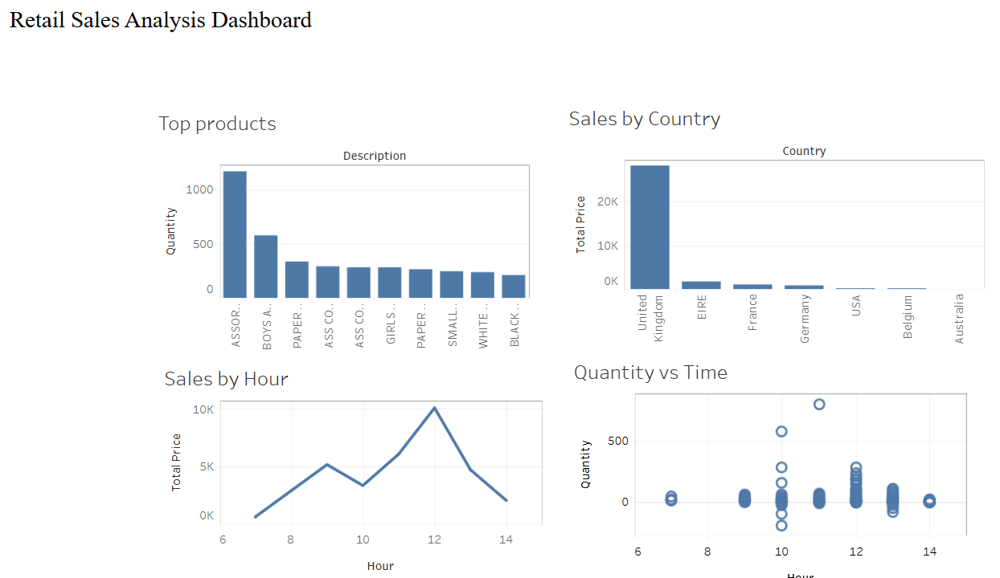
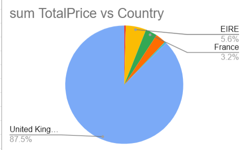

# Retail Sales Analysis

## Overview

This project performs end-to-end analysis of a retail sales dataset. It includes data cleaning, exploratory data analysis (EDA), SQL-style queries in Google Sheets, and interactive visualization using Tableau.

---

## Tools Used

* Python (Pandas, Jupyter Notebook)
* Google Sheets (QUERY, charts)
* Tableau Public (dashboard)

---

## Data Cleaning

* Removed unnecessary columns
* Handled missing values (Description, Customer ID)
* Standardized StockCode format
* Fixed invalid values (zero price, negative quantity handling)
* Removed duplicate records

---

## Exploratory Data Analysis

* Identified top-selling products
* Compared quantity vs revenue trends
* Analyzed country-wise sales distribution
* Examined hourly sales patterns
* Evaluated impact of returns (~6–7% of revenue)

---

## Google Sheets Analysis

* Used QUERY function (SELECT, WHERE, ORDER BY, GROUP BY)
* Created:

  * Bar chart (Top Products)
  * Pie chart (Country distribution)
  * Line chart (Sales by Hour)
  * Scatter plot (Quantity vs Time)

---

## Tableau Dashboard

🔗 https://public.tableau.com/app/profile/tulsi.naik/viz/RetailSalesAnalysisDashboard_17766088817530/Dashboard1

### Dashboard Preview

---

## Charts

---

## Key Insights

* Sales peak around **12 PM**
* United Kingdom dominates revenue
* A few products contribute majority of sales
* Returns have noticeable impact on overall performance

---

## Files in Repository

* `retail_scrub.ipynb` – Data cleaning and analysis
* `sales_clean_data.csv` – Cleaned dataset
* `sales_data_cleaned.xlsx` – Google Sheets work
* `dashboard.png` – Tableau dashboard preview
* `chart.png` – Charts from Sheets

---

## Author

Tulsi Naik
